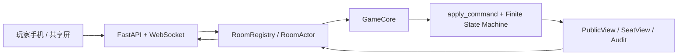

# 架构入口

本文件是面向贡献者的导航页。冻结的产品和规则契约位于
[`specs/README.md`](specs/README.md)。

## 分层

### `domain/`

纯领域层，不依赖传输、数据库、系统时间或 LLM。

- `model.py`：严格且不可变的游戏状态模型。
- `contracts.py`：命令、事件、投影和错误码契约。
- `state_machine.py`：唯一状态变化入口 `apply_command()`。
- `visibility.py`：公共、座位和主持人视角的授权投影。
- `replay.py`：确定性状态摘要。

### `application/`

运行时编排层。

- `core.py`：`GameCore.submit()`、`tick()`、revision 与幂等命令。
- `replay.py`：命令和系统超时回放。
- `simulation.py`：无头策略、种子局、不变量和 golden replay。
- `rooms.py`：房间、令牌、单写者 actor 与订阅分发。

### `interfaces/http_ws/`

传输适配层。

- REST 创建和加入房间。
- WebSocket 首帧认证、频道订阅和命令桥。
- 严格错误白名单、请求限速、连接背压和脱敏。

## 关键边界

- `domain/` 不得导入 FastAPI、WebSocket、数据库或 LLM SDK。
- 所有游戏状态变化必须经过 `apply_command()`。
- 客户端 actor 必须来自令牌，不得由请求体覆盖。
- 公共、座位和主持人数据只能通过对应投影读取。
- 未识别异常只写入服务端日志，客户端只收到安全错误码和 `request_id`。

## 验证

后端同时包含单元测试、HTTP/WebSocket 集成测试、100 局种子模拟和 9 个
golden replay。CI 在 Python 3.12 上运行 pytest、ruff、格式检查和 strict
mypy。
